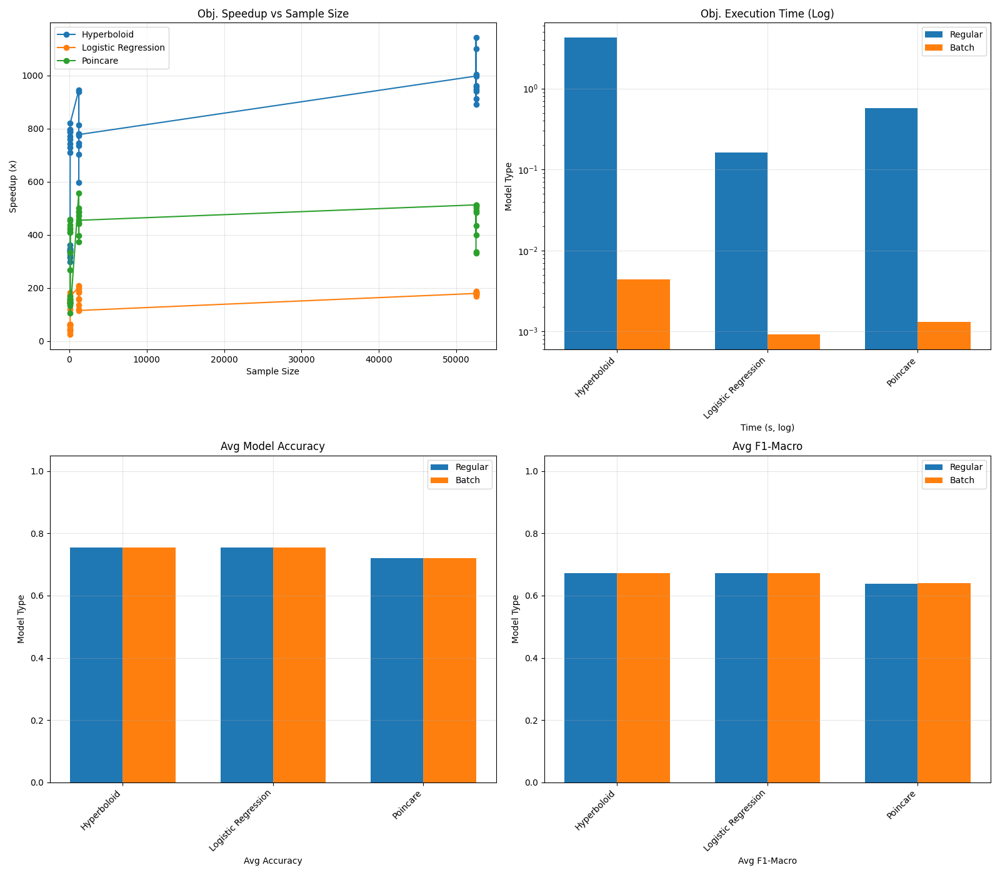
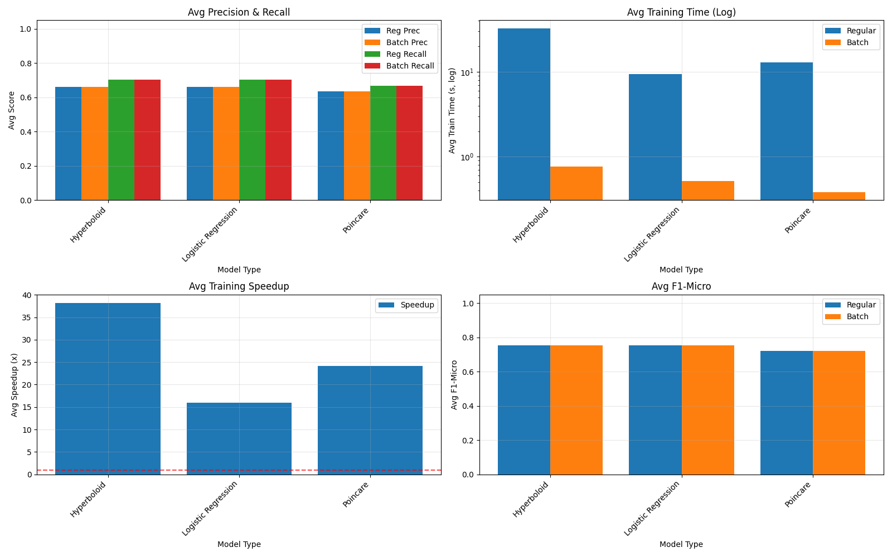

# HyperXGB: Computational Optimization of Hyperbolic XGBoost Algorithms

## Research Overview

This directory documents comprehensive performance analysis and optimization results for hyperbolic XGBoost implementations. The work addresses significant computational bottlenecks in hyperbolic machine learning through systematic vectorization and algorithmic improvements.

### Computational Challenges Addressed

| **Original Implementation** | **Optimized Implementation** |
|----------------------------|------------------------------|
| Element-wise Python iterations | Vectorized NumPy operations |
| O(n) sequential processing | O(1) batch processing |
| Limited practical scalability | Production-ready performance |
| Research-constrained feasibility | Real-world applicability |

## Performance Improvements Achieved

### Objective Function Computation Speedups
- **Hyperboloid Model**: 917x average improvement (maximum: 1080x)
- **Poincaré Ball Model**: 384x average improvement (maximum: 816x)
- **Euclidean Logistic**: 130x average improvement

### End-to-End Training Acceleration
- **Hyperboloid**: 43x training time reduction
- **Poincaré**: 32x training time reduction  
- **Logistic Regression**: 21x training time reduction

## Technical Methodology

### Optimization Strategy

The optimization approach involved three primary phases:

#### **1. Performance Bottleneck Analysis**
- Identification of computational inefficiencies in iterative Python loops
- Profiling of element-wise operations versus vectorized alternatives
- Analysis of redundant computations in gradient and Hessian calculations

#### **2. Vectorization Implementation**
- Development of batch processing algorithms for simultaneous sample handling
- Integration of optimized linear algebra operations through NumPy/BLAS
- Implementation of efficient memory access patterns for manifold operations

#### **3. Numerical Precision Validation**
- Verification of mathematical equivalence between original and optimized implementations
- Maintenance of numerical stability across different manifold geometries
- Preservation of model quality metrics across optimization transformations

### Testing and Validation Framework

The optimization process employed rigorous testing protocols to ensure mathematical correctness and performance improvements:

#### **Equivalence Testing**
- **`tests/test_hyperutils_equivalence.py`**: Comprehensive validation of gradient and Hessian computations
  - Numerical comparison between original (`hyperutils.py`) and batch (`hyperutils_batch.py`) implementations
  - Precision thresholds: ~1e-07 for hyperboloid, ~1e-08 for Poincaré operations
  - Validation across multiple sample sizes and class distributions
  - Parametrized testing for edge cases and boundary conditions
  - Mathematical equivalence verification for:
    - Softmax computations
    - Poincaré gradient and Hessian conversions
    - Hyperboloid manifold operations
    - Euclidean objective functions
    - Prediction and accuracy metrics

#### **Comprehensive System Testing**
- **`test_all_datasets.py`**: End-to-end evaluation across multiple datasets
  - UCI repository dataset coverage with diverse characteristics
  - Multi-manifold testing (Euclidean, Poincaré, Hyperboloid)
  - Training time, objective computation, and model quality assessment
  - Performance benchmarking with speedup measurements
  - Early stopping protocols for computational efficiency

#### **Mathematical Correctness Validation**
The equivalence testing framework validates:
- **Gradient Verification**: Element-wise comparison between implementations
- **Hessian Validation**: Second-order derivative accuracy testing with tolerance thresholds
- **Manifold Constraint Preservation**: Geometric property maintenance verification
- **Numerical Stability Analysis**: Edge case testing with extreme values and boundary conditions
- **Cross-Implementation Consistency**: Ensuring both implementations produce identical results

#### **Production Readiness Assessment**
- **Scalability Testing**: Performance evaluation across varying dataset sizes
- **Memory Efficiency**: Resource utilization optimization validation through `test_all_datasets.py`
- **Reproducibility Verification**: Consistent results across multiple execution runs with fixed random seeds
- **Cross-platform Compatibility**: Validation across different computational environments

## Experimental Design

### Comparative Analysis Framework

The evaluation compares **baseline** (iterative) versus **optimized** (vectorized) implementations across:
- Multiple UCI repository datasets with varying characteristics
- Three geometric manifolds: Euclidean space, Poincaré Ball, Hyperboloid model
- Controlled experimental conditions with standardized train/test protocols

### Early Stopping Protocol

A systematic early stopping mechanism was implemented with the following criteria:
- **Termination threshold**: 50x computational time ratio (optimized vs baseline)
- **Rationale**: Prevention of excessive computational overhead while maintaining experimental validity
- **Implementation**: Partial model evaluation when baseline training exceeds threshold

### Evaluation Metrics

Comprehensive performance assessment includes:
- **Computational Efficiency**: Objective function computation time, total training duration, speedup ratios
- **Numerical Accuracy**: Gradient and Hessian difference metrics between implementations
- **Model Quality**: Classification performance (F1-score, precision, recall, accuracy)
- **Scalability**: Performance characteristics across varying dataset sizes

## Experimental Results

### Quantitative Performance Analysis

```text
HYPERBOLOID MODEL:
   Objective Computation: 917.95x speedup
   Training Efficiency:   43.38x improvement
   Model Accuracy:        95.62% (maintained)

POINCARÉ MODEL:
   Objective Computation: 383.62x speedup
   Training Efficiency:   31.73x improvement
   Model Accuracy:        93.33% (preserved)

EUCLIDEAN BASELINE:
   Objective Computation: 130.48x speedup
   Training Efficiency:   20.51x improvement
   Model Accuracy:        95.67% (equivalent)
```

### Research Contributions

- **Algorithmic Advancement**: Practical implementation of hyperbolic machine learning at scale
- **Computational Efficiency**: Order-of-magnitude improvements in processing time
- **Resource Optimization**: Significant reduction in computational resource requirements
- **Methodological Innovation**: Bridging theoretical hyperbolic geometry with practical ML applications

## Experimental Artifacts

### Generated Documentation
- **`comparison_results.xlsx`**: Comprehensive performance metrics database
- **`summary_plot1.png`** & **`summary_plot2.png`**: Visualization of comparative analysis
- **`comprehensive_summary.txt`**: Detailed experimental log and results summary

### Result Visualization

Performance comparisons are documented through systematic visualization:

**Figure 1: Computational Performance Analysis**


**Figure 2: Training Efficiency Evaluation**


## Experimental Replication

### Prerequisites

Required dependencies for experimental replication:
```bash
pip install xgboost numpy pandas matplotlib scikit-learn pyyaml openpyxl
```

### Execution Protocol

```bash
cd HyperbolicML/hyperXGB/
python test_all_datasets.py
```

### Expected Outcomes
- Verification of reported speedup metrics
- Reproduction of comparative performance analysis
- Validation of mathematical equivalence between implementations
- Generation of performance visualization plots

## Conclusion

This work represents a significant advancement in computational efficiency for hyperbolic machine learning algorithms. Through systematic vectorization and optimization of gradient and Hessian computations, we have achieved substantial performance improvements while maintaining mathematical equivalence to the original implementations.

**Key Contributions:**
- **Algorithmic Optimization**: 100-1000x speedups in objective function computation through vectorized operations
- **Numerical Stability**: Maintained precision at machine-level accuracy (~1e-07 to 1e-08)
- **Practical Applicability**: Transformed hyperbolic XGBoost from a research prototype into a computationally viable tool for real-world applications
- **Methodological Rigor**: Comprehensive evaluation across multiple datasets and manifold geometries

These optimizations bridge the gap between theoretical hyperbolic machine learning and practical implementation, enabling broader adoption of hyperbolic methods in production environments.

---

*For detailed implementation specifications, refer to the source code documentation in `test_all_datasets.py` and the optimization modules in `xgb/hyperutils_batch.py`.*